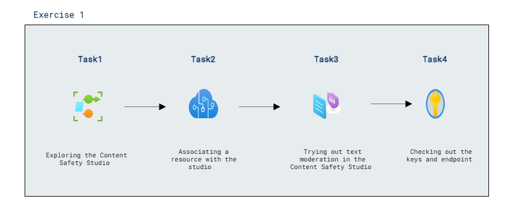
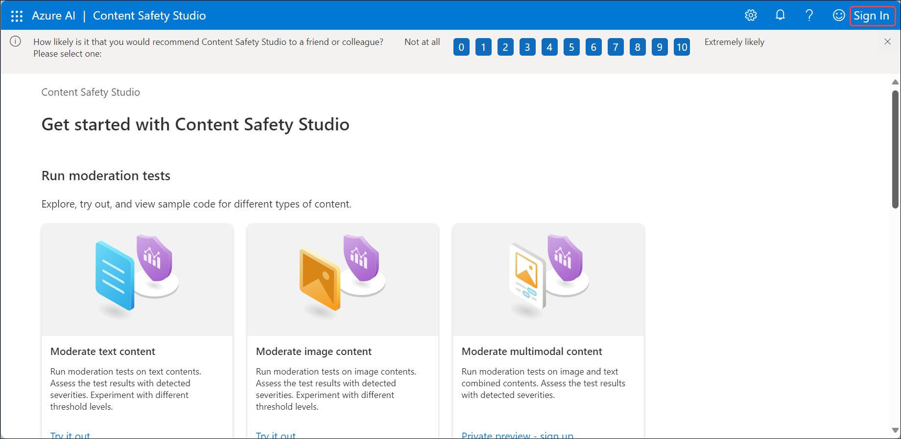
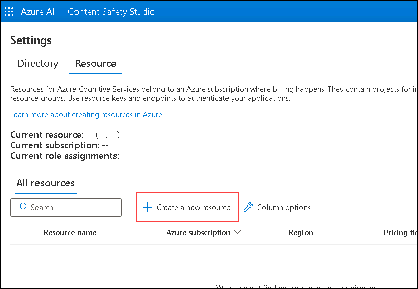
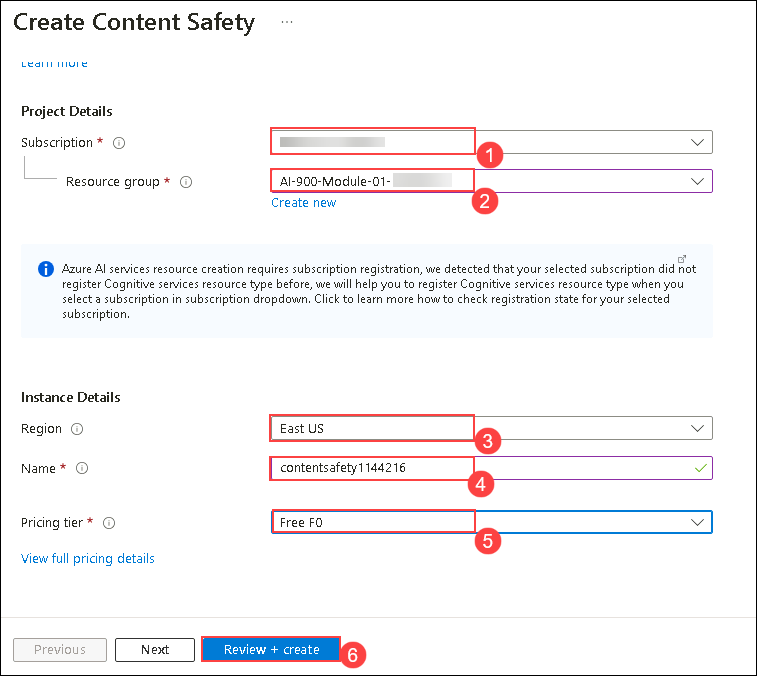
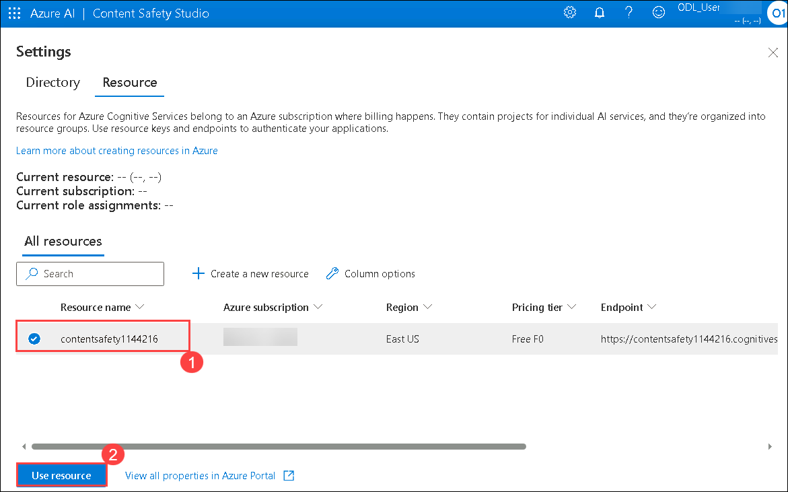

# Module 01: Explore Azure AI services

## Lab overview

In this exercise, you will set up a single-service resource in Azure AI Content Safety Studio to evaluate and moderate text and image content, providing severity scores for various categories, ranging from safe to high.

## Lab objectives
In this lab, you will perform:
- Exploring the Content Safety Studio
- Associating a resource with the studio 
- Trying out text moderation in the Content Safety Studio
- Checking out the keys and endpoint

## Architecture Diagram

> **Note**
> The goal of this exercise is to get a general sense of how Azure AI services are provisioned and used. Content Safety is used as an example, but you are not expected to gain a comprehensive knowledge of content safety in this exercise!

## Exercise 1: Explore Azure AI services

### Task 1: Explore the Content Safety Studio 

1. Open the [Content Safety Studio](https://contentsafety.cognitive.azure.com?azure-portal=true). If you are not logged in, you will need to sign in. Select **Sign In** on the top right of the screen.  

    

1. You'll see the **Sign into Microsoft Azure** tab. Here, enter your credentials:

    - **Email/Username:** <inject key="AzureAdUserEmail"></inject>
 
      
 
1. Next, provide your password:
 
   - **Password:** <inject key="AzureAdUserPassword"></inject>
 
       
 
1. If prompted to stay signed in, you can click "No."

    

1. The Content Safety Studio is set up like many other studios for Azure AI services. On the menu at the top of the screen, click on the icon on the left of **Azure AI**. You will see a drop-down list of other studios designed for development with Azure AI services. You can click on the icon again to hide the list.

       

### Task 2: Associate a resource with the studio 

Before using the studio, you need to associate an Azure AI services resource with the studio. Depending on the studio, you may find you need a specific single-service resource, or can use a general multi-service resource. In the case of the Content Safety Studio, you can use the service by creating a single-service *Content Safety* resource or *Azure AI services* general multi-service resource. In the steps below, we will create a single-service Content Safety resource. 

1. On the top right of the screen, click on the **Settings** icon. 

   

2. On the **Settings** page, you will see a *Directory* tab and *Resource* tab. On the *Resource* tab, select **Create a new resource**. This takes you to page to create a resource in the Azure Portal.

    

   > **Note**: The **Directory** tab allows users to select different directories from which to create resources. You do not need to change its settings unless you wish to use a different directory. 

1. On the *Create Content Safety* page in the [Azure Portal](https://portal.azure.com?auzre-portal=true), you need to configure several details to create your resource. Configure it with the following settings:
    - **Subscription (1)**: Use the existing Azure subscription.
    - **Resource group (2)**: Select **AI-900-Module-01-<inject key="DeploymentID" enableCopy="false"/>**
    - **Region (3)**: Select **<inject key="location" enableCopy="false"/>**
    - **Name (4)**: Enter **contentsafety<inject key="DeploymentID" enableCopy="false"/>**
    - **Pricing tier (5)**:Select **Free F0** from the drop-down.
    - Select **Review + Create (6)**

      

1. Review the configuration. Then select **Create**. The screen will indicate when the deployment is complete. 

   *Congrats! You've just created, or provisioned, an Azure AI services resource. The one you provisioned in particular is a single-service Content Safety service resource.*

   > - **Congratulations** on completing the task! Now, it's time to validate it. Here are the steps:
    > - Click Lab Validation tab located at the upper right corner of the lab guide section and navigate to the Lab Validation tab.
    > - Hit the Validate button for the corresponding task.
    > - If you receive a success message, you can proceed to the next task. If not, carefully read the error message and retry the step, following the instructions in the lab guide.
    > - If you need any assistance, please contact us at labs-support@spektrasystems.com. We are available 24/7 to help you out.

1. When the deployment is complete, open up a new tab and return to the [Content Safety Studio](https://contentsafety.cognitive.azure.com?azure-portal=true). 

2. Select the **Settings** icon on the top right of the screen again. This time you should see that your newly created resource has been added to the list.  

3. On the Content Safety Studio's Settings page, select the **Azure AI service (1)** resource you just created and click **Use resource (2)** on the bottom of the screen. You will be taken back to the studio home page. Now you can begin using the studio with your newly created resource.

   

### Task 3: Try out text moderation in the Content Safety Studio

1. On the Content Safety Studio home page, under *Run moderation tests*, navigate to the **Moderate text content** box and click **Try it out**.
2. Under run a simple test, click **Safe Content**. Notice that text is displayed in the box below. 
3. Click **Run test**. Running a test calls the Content Safety Service's deep learning model. The deep learning model has already been trained to recognize un-safe content.
4. In the *Results* panel, inspect the results. There are four severity levels from safe to high, and four types of harmful content. Does the Content Safety AI service consider this sample to be acceptable or not? What's important to note is that the results are within a confidence interval. A well-trained model, like one of Azure AI's out-of-the-box models, can return results that have a high probability of matching what a human would label the result. Each time you run a test, you call the model again. 
5. Now try another sample. Select the text under Violent content with misspelling. Check that the content is displayed in the box below.
6. Click **Run test** and inspect the results in the Results panel again. 

You can run tests on all the samples provided, then inspect the results.

### Task 4: Check out the keys and endpoint

These capabilities you tested can be programmed into all sorts of applications. The keys and endpoint used for application development can be found both in the Content Safety Studio and the Azure Portal. 

1. In the Content Safety Studio, navigate back to the **Settings** page, with the *Resources* tab selected. Look for the resource you used. Scroll across to see the endpoint and key for your resource. 
1. In the Azure Portal, you will see that these are the *same* endpoint and *different* keys for your resource. To check it out, head to the [Azure Portal](https://portal.azure.com?auzre-portal=true). Search for *Content Safety* on the top search bar. Find your resource and click on it. On the left-hand menu, look under *Resource Management* for *Keys and Endpoints*. Select **Keys and Endpoints** to view the endpoint and keys for your resource. 

### Review
In this lab, you have completed:
- Explored Content Safety Studio
- Associate a resource with safety studio
- Tried out text moderation in the Content Safety Studio
- Check out the keys and endpoint

## You have successfully completed this lab.

## Reference Link

https://learn.microsoft.com/en-us/azure/ai-services/content-safety/overview
