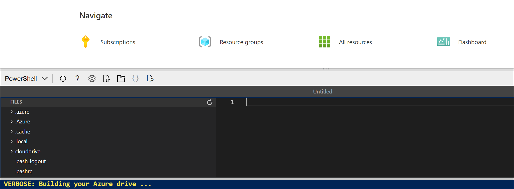
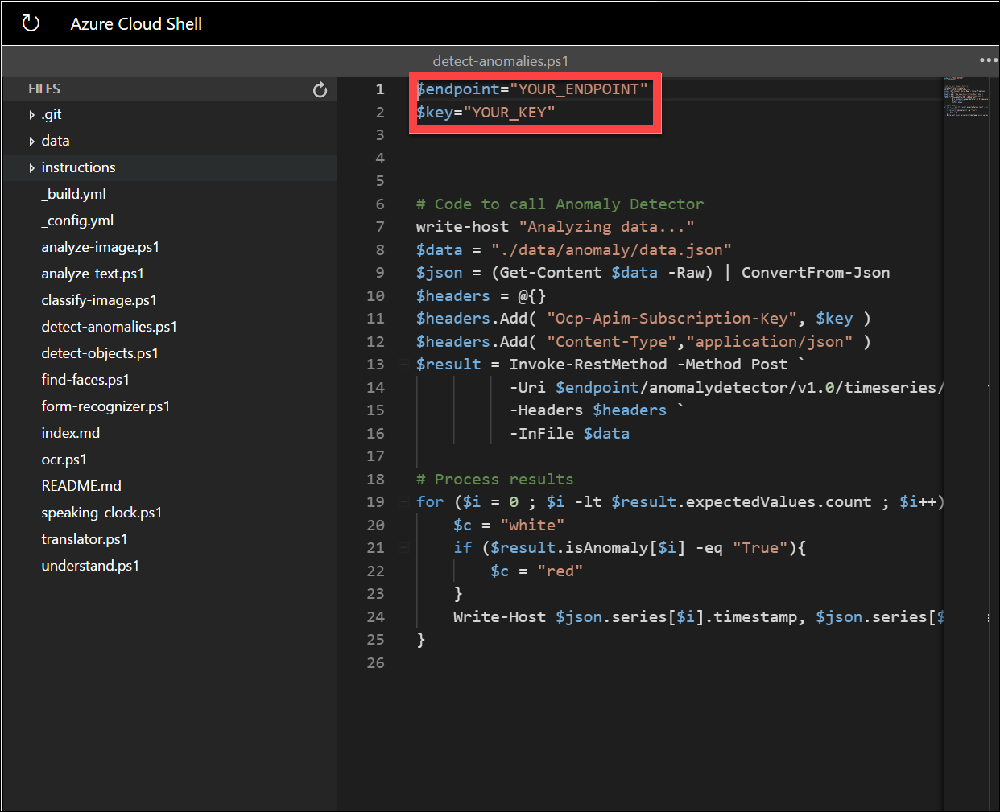
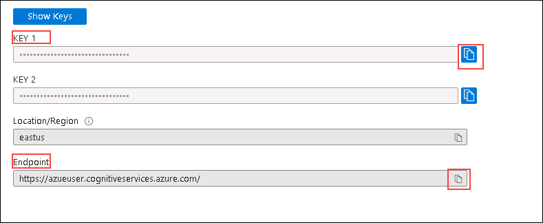
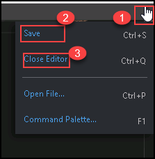

# Explore Cognitive Services

> **Note**
> To complete this lab, you will need an [Azure subscription](https://azure.microsoft.com/free?azure-portal=true) in which you have administrative access.

Azure Cognitive Services encapsulate common AI functionality that can be categorized into four main pillars: vision, speech, language, and decision services. In this exercise you will take a look at one of the decision services to get a general sense of how to provision and use a cognitive services resource in a software application.

The specific cognitive service you'll explore in this exercise is *Anomaly Detector*. Anomaly Detector is used to analyze data values over time, and to detect any unusual values that might indicate a problem or an issue for further investigation. For example, a sensor in a temperature-controlled storage facility might monitor the temperature every minute and log the measured values. You can use the Anomaly Detector service to analyze the logged temperature values and flag any that fall significantly outside of the normal range of expected temperatures.

To test the capabilities of the Anomaly Detection service, we'll use a simple command-line application that runs in the Cloud Shell. The same principles and functionality apply in real-world solutions, such as web sites or phone apps.

> **Note**
> The goal of this exercise is to get a general sense of how cognitive services are provisioned and used. Anomaly Detector is used as an example, but you are not expected to gain a comprehensive knowledge of anomaly detection in this exercise!

## Create an Anomaly Detector resource

Let's start by creating an **Anomaly Detector** resource in your Azure subscription:

1. In the lab virtual machine, Start the Microsoft Edge browser.

1. In the Edge browser, navigate to the Azure portal at https://portal.azure.com.

1. In the **Sign in** dialog box, copy and paste in the **Username** <inject key="AzureAdUserEmail"></inject> and then select Next.

1. In the **Enter password** dialog box, copy and paste the **Password**  <inject key="AzureAdUserPassword"></inject> and then select **Sign in**.

    >**Note**
    > On the Welcome to Microsoft Edge page, select  **Start without your data**  and on the help for importing Google browsing data page, select 		      the **Continue without this data** button. Then, proceed to select  **Confirm and start browsing**  on the next page.


1. Click the **&#65291;Create a resource** button, search for Anomaly Detector, and create an **Anomaly Detector** resource with the following settings:
    - **Subscription**: Use existing subscription.
    - **Resource group**: Select **AI-900-Module-01-<inject key="DeploymentID" enableCopy="false"/>**.
    - **Region**: Select the same region where your resource group was created ( i.e. Easus2)
    - **Name**: enter **myanomalydetector-<inject key="DeploymentID" enableCopy="false"/>**
    - **Pricing tier**: Free F0

1. **Review and create the resource.** Wait for deployment to complete, and then go to the deployed resource.

1. View the **Keys and Endpoint** page for your Anomaly Detector resource. 
   
      >**Note** 
      >You will need the endpoint and keys to connect from client applications.

## Run Cloud Shell

To test the capabilities of the Anomaly Detector service, we'll use a simple command-line application that runs in the Cloud Shell on Azure.

1. In the Azure portal, select the **[>_]** (*Cloud Shell*) button at the top of the page to the right of the search box. This opens a Cloud Shell pane at the bottom of the portal.

    

1. The first time you open the Cloud Shell, you may be prompted to choose the type of shell you want to use (*Bash* or *PowerShell*). Select **PowerShell**. If you do not see this option, skip the step.  

1. If you are prompted to create storage for your Cloud Shell, ensure your subscription is selected and click on **Show advanced settings**. Please make sure you have selected your resource group **AI-900-Module-01-<inject key="DeploymentID" enableCopy="false"/>** and enter **blob<inject key="DeploymentID" enableCopy="false"/>** for the **Storage account Name** and enter **blobfileshare<inject key="DeploymentID" enableCopy="false"/>** for the **File share Name** , then click on **Create Storage**.

    

1. Make sure the type of shell indicated on the top left of the Cloud Shell pane is switched to *PowerShell*. If it is *Bash*, switch to *PowerShell* by using the drop-down menu.

    

1. Wait for PowerShell to start. You should see the following screen in the Azure portal:  

    

## Configure and run a client application

Now that you have a Cloud Shell environment, you can run a simple application that uses the Anomaly Detector service to analyze data.

1. In the command shell, enter the following command to download the sample application and save it to a folder called ai-900.

    ```PowerShell
    git clone https://github.com/MicrosoftLearning/AI-900-AIFundamentals ai-900
    ```
    
    >**Note** 
    >To Paste the Code right click inside the cloud Shell and then Click on Paste.

1. The files are downloaded to a folder named **ai-900**. Now we want to see all of the files in your Cloud Shell storage and work with them. Type the following command into the shell:

     ```PowerShell
    code .
    ```

    Notice how this opens up an editor like the one in the image below: 

    

1. In the **Files** pane on the left, expand **ai-900** and select **detect-anomalies.ps1**. This file contains some code that uses the Anomaly Detection service, as shown here:

    

1. Don't worry too much about the details of the code, the important thing is that it needs the endpoint URL and either of the keys for your Anomaly Detector resource. Copy these from the **Keys and Endpoints** page for your resource (which should still be in the top area of the browser) and paste them into the code editor, replacing the  **YOUR_KEY** and **YOUR_ENDPOINT** placeholder values respectively.

    > **Tip**
    > You may need to use the separator bar to adjust the screen area as you work with the **Keys and Endpoint** and **Editor** panes.
    
    

    After pasting the key and endpoint values, the first two lines of code should look similar to this:

    ```PowerShell
    $key="1a2b3c4d5e6f7g8h9i0j...."    
    $endpoint="https..."
    ```

1. At the top right of the editor pane, use the **...** button to open the menu and select **Save** to save your changes. Then open the menu again and select **Close Editor**.

      
      
      >**Note** 
      > If you will be not able to found this options, you can use also Shortcut Keys **ctrl + S** to save and **ctrl + Q** to close editor.
      
    Remember, anomaly detection is an artificial intelligence technique used to determine whether values in a series are within expected parameters. The sample client application will use your Anomaly Detector service to analyze a file containing a series of date/times and numeric values. The application should return results indicating at each time point, whether the numeric value is within expected parameters.

1. In the PowerShell pane, enter the following commands to run the code:

    ```PowerShell
    cd ai-900
    .\detect-anomalies.ps1
    ```

1. Review the results, noting that the final column in the results is **True** or **False** to indicate if the value recorded at each date/time is considered an anomaly or not. Consider how we could use this information in a real-life situation. What action could the application trigger if the values were of fridge temperature or blood pressure and anomalies were detected?
     
      

## Learn more

This simple app shows only some of the capabilities of the Anomaly Detector service. To learn more about what you can do with this service, see the [Anomaly Detector page](https://azure.microsoft.com/services/cognitive-services/anomaly-detector/).
