# Explore clustering with Azure Machine Learning Designer

> **Note**
> To complete this lab, you will need an [Azure subscription](https://azure.microsoft.com/free?azure-portal=true) in which you have administrative access.

## Create an Azure Machine Learning workspace  

1. In the lab virtual machine, Start the Microsoft Edge browser.

1. In the Edge browser, navigate to the Azure portal at https://portal.azure.com.

1. In the **Sign in** dialog box, copy and paste in the **Username : odl_user_<inject key="DeploymentID" enableCopy="true" />@cloudlabsai.com** and then select Next.

1. In the **Enter password** dialog box, copy and paste the **Password** provided in the **environment details page** and then select **Sign in**.

    >**Note**
    > On the Welcome to Microsoft Edge page, select  **Start without your data**  and on the help for importing Google browsing data page, select 		      the **Continue without this data** button. Then, proceed to select  **Confirm and start browsing**  on the next page.


1. Select **+ Create a resource**, search for Machine Learning, and create a new **Azure Machine Learning** resource with an *Azure Machine Learning* plan. Use the following settings:
    - **Subscription**: Use existing Azure subscription.
    - **Resource group**: Select **AI-900-Module-02c-<inject key="DeploymentID" enableCopy="false" />**.
    - **Workspace name**: Give name **Workspace-<inject key="DeploymentID" enableCopy="false" />.**
    - **Region**: Use default region.
    - **Storage account**: Note the default new storage account that will be created for your workspace.
    - **Key vault**: Note the default new key vault that will be created for your workspace.
    - **Application insights**: Note the default new application insights resource that will be created for your workspace.
    - **Container registry**: None (one will be created automatically the first time you deploy a model to a container)

1. Select **Review + create**, then select **Create**. Wait for your workspace to be created (it can take a few minutes), and then go to the deployed resource.

1. Select **Launch studio** (or open a new browser tab and navigate to [https://ml.azure.com](https://ml.azure.com?azure-portal=true), and sign into Azure Machine Learning studio using your Microsoft account).

1. In Azure Machine Learning studio, you should see your newly created workspace **workspace-<inject key="DeploymentID" enableCopy="false" />**. If that is not the case, select your Azure directory in the left-hand menu. Then from the new left-hand menu select **Workspaces**, where all the workspaces associated to your directory are listed, and select the one you created for this exercise.

## Create compute

1. In [Azure Machine Learning studio](https://ml.azure.com?azure-portal=true), select the **&#8801;** icon (a menu icon that looks like a stack of three lines) at the top left to view the various pages in the interface (you may need to maximize the size of your screen). You can use these pages in the left hand pane to manage the resources in your workspace. Select the **Compute** page (under **Manage**).

2. On the **Compute** page, select the **Compute clusters** tab, and add a new compute cluster with the following settings. You'll use this to train a machine learning model:
    - **Location**: *Select the same as your workspace. If that location is not listed, choose the one closest to you*.
    - **Virtual machine tier**: Dedicated
    - **Virtual machine type**: CPU
    - **Virtual machine size**:
        - Choose **Select from all options**
        - Search for and select **Standard_DS11_v2**
    - Select **Next**
    - **Compute name**: *enter a unique name*.
    - **Minimum number of nodes**: 0
    - **Maximum number of nodes**: 2
    - **Idle seconds before scale down**: 120
    - **Enable SSH access**: *do not select*
    - Select **Create**

> **Note**
> Compute instances and clusters are based on standard Azure virtual machine images. For this module, the *Standard_DS11_v2* image is recommended to achieve the optimal balance of cost and performance. If your subscription has a quota that does not include this image, choose an alternative image; but bear in mind that a larger image may incur higher cost and a smaller image may not be sufficient to complete the tasks. Alternatively, ask your Azure administrator to extend your quota.

The compute cluster will take some time to be created. You can move onto the next step while you wait.

## Create a pipeline in designer

To get started with Azure Machine Learning designer, first you must create a pipeline.

1. In [Azure Machine Learning studio](https://ml.azure.com?azure-portal=true), expand the left pane by selecting the menu icon at the top left of the screen. View the **Designer** page (under **Author**), and select the plus sign to create a new pipeline.

1. At the top right-hand side of the screen, select **Settings**. If the **Settings** pane is not visible, select the wheel icon next to the pipeline name at the top.

1. In **Settings**, you must specify a compute target on which to run the pipeline. Under **Select compute type**, select **Compute cluster**. Then under **Select Azure ML compute cluster**, select the compute cluster you created previously.

1. In **Settings**, under **Draft Details**, change the draft name (**Pipeline-Created-on-*date***) to **Train Penguin Clustering**.

1. Select the *close icon* on the top right of the **Settings** pane to close the pane, and then select **Save**.

    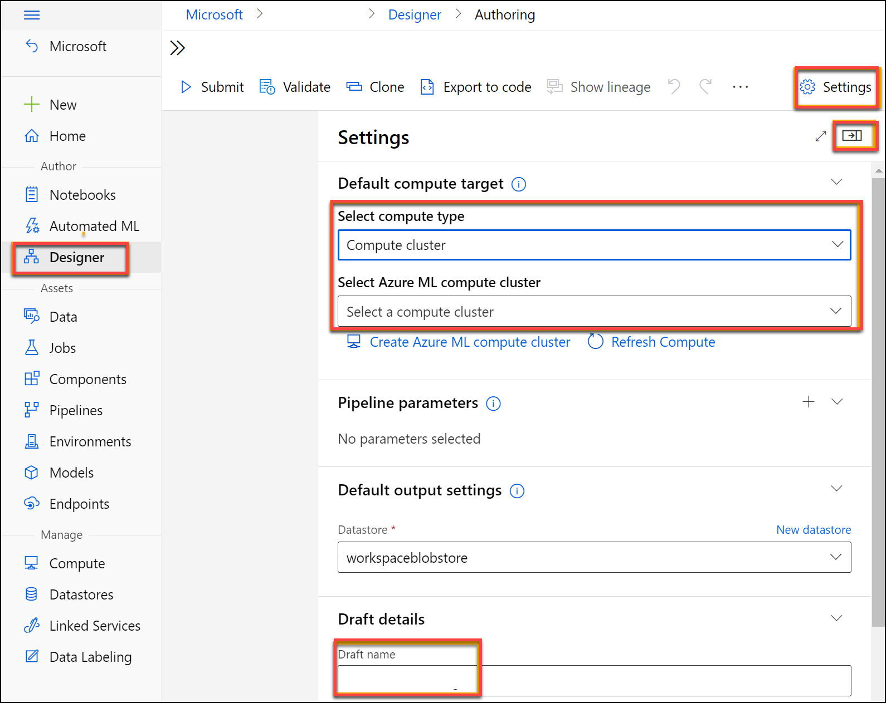

## Create a dataset

In Azure Machine Learning, data for model training and other operations is usually encapsulated in an object called a *dataset*. In this module, you'll use a dataset that includes observations of three species of penguin.

1. In [Azure Machine Learning studio](https://ml.azure.com?azure-portal=true), expand the left pane by selecting the menu icon at the top left of the screen. View the **Data** page (under **Assets**). The Data page contains specific data files or tables that you plan to work with in Azure ML. You can create datasets from this page as well.

1. On the **Data** page, under the **Data assets** tab, select **Create**. Then configure a data asset with the following settings:
    * **Data type**:
        * **Name**: penguin-data
        * **Description**: Penguin data
        * **Dataset type**: Tabular
    * **Select Next**
    * **Data source**: From Web Files
    *  **Select Next**
    * **Web URL**:
        * **Web URL**: https://aka.ms/penguin-data
        * **Skip data validation**: *do not select*
    * **Select Next**
    * **Settings**:
        * **File format**: Delimited
        * **Delimiter**: Comma
        * **Encoding**: UTF-8
        * **Column headers**: Only first file has headers
        * **Skip rows**: None
        * **Dataset contains multi-line data**: *do not select*
    * **Select Next**
    * **Schema**:
        * Include all columns other than **Path**
        * Review the automatically detected types
    * **Select Next**
    * **Review**
        * Select **Create**

1. After the dataset has been created, open it and view the **Explore** page to see a sample of the data. This data represents measurements of the culmen (bill) length and depth, flipper length, and body mass for multiple observations of penguins. There are three species of penguin represented in the dataset: *Adelie*, *Gentoo*, and *Chinstrap*.

> **Note**
> The penguins dataset used in the this exercise is a subset of data collected and made available by [Dr. Kristen
Gorman](https://www.uaf.edu/cfos/people/faculty/detail/kristen-gorman.php)
and the [Palmer Station, Antarctica LTER](https://pal.lternet.edu/), a
member of the [Long Term Ecological Research
Network](https://lternet.edu/).

### Load data to canvas

1. Return to your pipeline by selecting **Designer** on the left-hand menu. On the **Designer** page, select the **Train Penguin Clustering**.

1. Next to the pipeline name on the left, select the arrows icon to expand the panel if it is not already expanded. The panel should open by default to the **Asset library** pane, indicated by the books icon at the top of the panel. Note that there is a search bar to locate assets. Notice two buttons, **Data** and **Component**.

    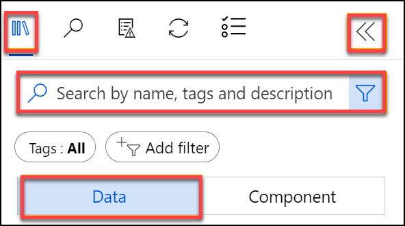

1. Click on **Data**. Search for and place the **penguin-data** dataset onto the canvas.

1. Click on **penguin-data** then click on **Use Data**

1. Right-click (Ctrl+click on a Mac) the **penguin-data** dataset on the canvas, and click on **Preview data**.

1. Review the *Profile* schema of the data, noting that you can see the distributions of the various columns as histograms. Then select the **CulmenLength** column. The dataset should look similar to this:

    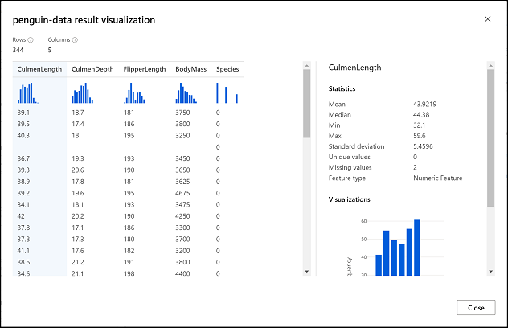

1. Note the following characteristics of the dataset:

    - The dataset includes the following columns:
        - **CulmenLength**: Length of the penguin's bill in millimeters.
        - **CulmenDepth**: Depth of the penguin's bill in millimeters.
        - **FlipperLength**: Length of the penguin's flipper in millimeters.
        - **BodyMass**: Weight of the penguin in grams.
        - **Species**: Species indicator (0:"Adelie", 1:"Gentoo", 2:"Chinstrap")
    - There are two missing values in the **CulmenLength** column (the **CulmenDepth**, **FlipperLength**, and **BodyMass** columns also have two missing values).
    - The measurement values are in different scales (from tens of millimeters to thousands of grams).

1. Close the dataset visualization so you can see the dataset on the pipeline canvas.

## Apply transformations

1. In the **Asset library** pane on the left, click on **Component**, which contain a wide range of modules you can use for data transformation and model training. You can also use the search bar to quickly locate modules.

    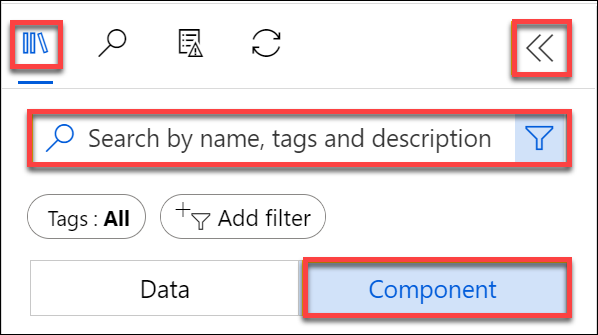

1. To cluster the penguin observations, we're going to use only the measurements - we'll ignore the species column. So, search for a **Select Columns in Dataset** module and place it on the canvas, below the **penguin-data** module and connect the output at the bottom of the **penguin-data** module to the input at the top of the **Select Columns in Dataset** module, like this:

    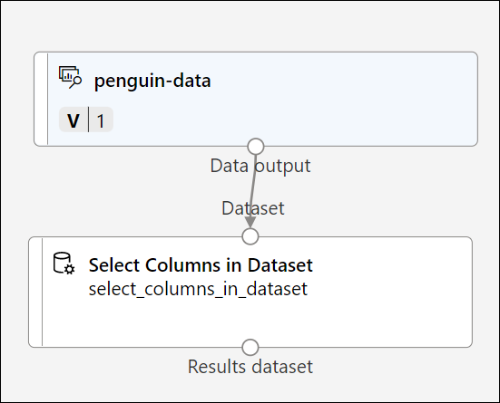

1. Double click on the **Select Columns in Dataset** module, and in the pane on the right, select **Edit column**. Then in the **Select columns** window, select **By name** and use the **+** links to select the column names **CulmenLength**, **CulmenDepth**, **FlipperLength**, and **BodyMass**; like this:

    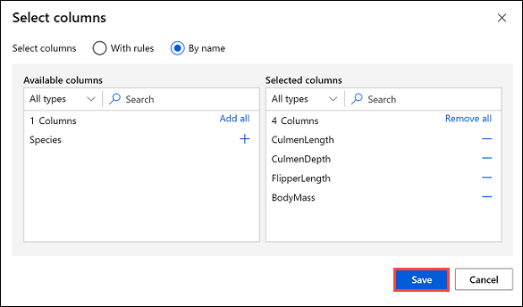

1. Close the **Select Columns in a Dataset** module settings to return to the designer canvas.

1. In the **Asset library**, search for a **Clean Missing Data** module and place it onto the canvas, below the **Select columns in a dataset** module and connect them like this:

    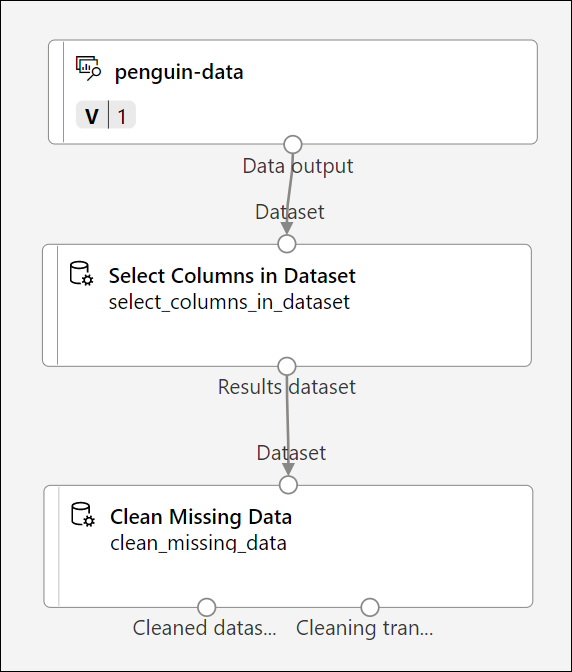

1. Double click the **Clean Missing Data** module, and in the settings pane on the right, click **Edit column**. Then in the **Columns to be cleaned** window, select **With rules** and include **All columns**; like this:

    

1. With the **Clean Missing Data** module still selected, in the settings pane, set the following configuration settings:
    - **Minimum missing value ratio**: 0.0
    - **Maximum missing value ratio**: 1.0
    - **Cleaning mode**: Remove entire row

1. In the **Asset library**, search for a **Normalize Data** module and place it to the canvas, below the **Clean Missing Data** module. Then connect the left-most output from the **Clean Missing Data** module to the input of the **Normalize Data** module.

    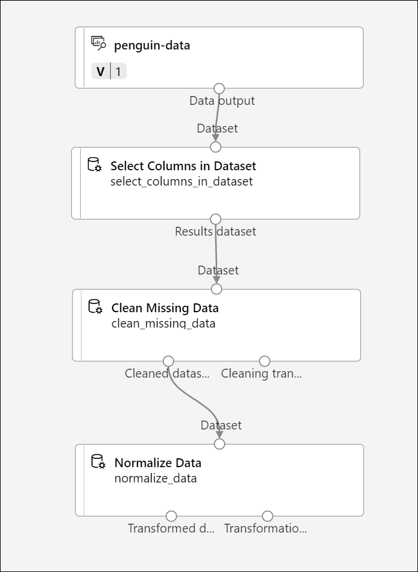

1. Double click the **Normalize Data** module, and in the pane on the right, set the **Transformation method** to **MinMax** and select **Edit column**. Then in the **Columns to transform** window, select **With rules** and include **All columns**; like this:

    

1. Close the **Normalize Data** module settings to return to the designer canvas.

## Run the pipeline

To apply your data transformations, you need to run the pipeline as an experiment.

1. Select **Submit**, and run the pipeline as a **new experiment** named **mslearn-penguin-training** on your compute cluster.

1. Wait for the run to finish. This may take 5 minutes or more.

    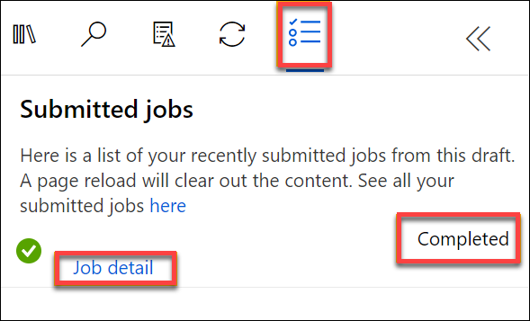

    Notice that the left hand panel is now on the **Submitted jobs** pane. You will know when the run is complete because the status of the job will change to **Completed**.

## View the transformed data

1. When the run has completed, the dataset is now prepared for model training. Click on **Job detail**. You will be taken to another tab which will show the modules like this:

    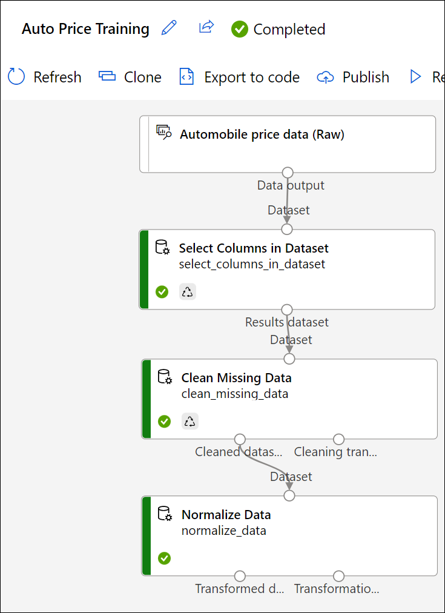

1. In the new tab, right click on the **Normalize Data** module, select **Preview data**, then select **Transformed dataset** to view the results.

1. View the data, noting that the **Species** column has been removed, there are no missing values, and the values for all four features have been normalized to a common scale.

1. Close the normalized data result visualization. Return to the previous pipeline tab.

Now that you have selected and prepared the features you want to use from the dataset, you're ready to use them to train a clustering model.

After you've used data transformations to prepare the data, you can use it to train a machine learning model.

## Add training modules

Work through the following steps to extend the **Train Penguin Clustering** pipeline as shown here:


Follow the steps below, using the image above for reference as you add and configure the required modules.

1. Open the **Train Penguin Clustering** pipeline, if it's not already open.

1. In the **Asset library** pane on the left, search for and place a **Split Data** module onto the canvas under the **Normalize Data** module. Then connect the left output of the **Normalize Data** module to the input of the **Split Data** module.

    >**Tip**
    > Use the search bar to quickly locate modules. 

1. Select the **Split Data** module, and configure its settings as follows:
    * **Splitting mode**: Split Rows
    * **Fraction of rows in the first output dataset**: 0.7
    * **Randomized split**: True
    * **Random seed**: 123
    * **Stratified split**: False

1. In the **Asset library**, search for and place a **Train Clustering Model** module to the canvas, under the **Split Data** module. Then connect the *Results dataset1* (left) output of the **Split Data** module to the *Dataset* (right) input of the **Train Clustering Model** module.

1. The clustering model should assign clusters to the data items by using all of the features you selected from the original dataset. Double click the **Train Clustering Model** module and in the right hand pane, select **Edit column**. Use the **With rules** option to include all columns; like this:

    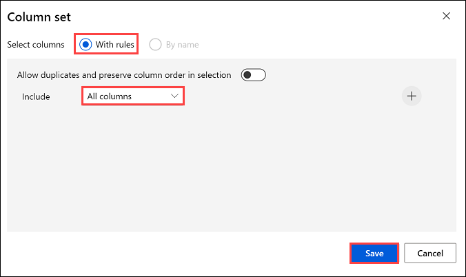

1. The model we're training will use the features to group the data into clusters, so we need to train the model using a *clustering* algorithm. In the **Asset library**, search for and place a **K-Means Clustering** module to the canvas, to the left of the **penguin-data** dataset and above the **Train Clustering Model** module. Then connect its output to the **Untrained model** (left) input of the **Train Clustering Model** module.

1. The *K-Means* algorithm groups items into the number of clusters you specify - a value referred to as ***K***. Select the **K-Means Clustering** module and in the right hand pane, set the **Number of centroids** parameter to **3**.

    > **Note**
    > You can think of data observations, like the penguin measurements, as being multidimensional vectors. The K-Means algorithm works by:
    > 1. initializing *K* coordinates as randomly selected points called *centroids* in  *n*-dimensional space (where *n* is the number of dimensions in the feature vectors).
    > 2. Plotting the feature vectors as points in the same space, and assigning each point to its closest centroid.
    > 3. Moving the centroids to the middle of the points allocated to it (based on the *mean* distance).
    > 4. Reassigning the points to their closest centroid after the move.
    > 5. Repeating steps 3 and 4 until the cluster allocations stabilize or the specified number of iterations has completed.

   After using 70% of the data to train the clustering model, you can use the remaining 30% to test it by using the model to assign the data to clusters.

1. In the **Asset library**, search for and place an **Assign Data to Clusters** module to the canvas, below the **Train Clustering Model** module. Then connect the **Trained model** (left) output of the **Train Clustering Model** module to the **Trained model** (left) input of the **Assign Data to Clusters** module; and connect the **Results dataset2** (right) output of the **Split Data** module to the **Dataset** (right) input of the **Assign Data to Clusters** module.

## Run the training pipeline

Now you're ready to run the training pipeline and train the model.

1. Ensure your pipeline looks like this:

    

1. Select **Submit**, and run the pipeline using the existing experiment named **mslearn-penguin-training** on your compute cluster.

1. Wait for the experiment run to finish. This may take 5 minutes or more.

1. When the experiment run has finished, select **Job detail**. In the new tab, right click on the **Assign Data to Clusters** module, select **Preview data**, then select **Results dataset** to view the results.

1. Scroll down, and note the **Assignments** column, which contains the cluster (0, 1, or 2) to which each row is assigned. There are also new columns indicating the distance from the point representing this row to the centers of each of the clusters - the cluster to which the point is closest is the one to which it is assigned.

1. Close the **Assign Data to Clusters** visualization. Return to the pipeline tab.

The model is predicting clusters for the penguin observations, but how reliable are its predictions? To assess that, you need to evaluate the model.

Evaluating a clustering model is made difficult by the fact that there are no previously known *true* values for the cluster assignments. A successful clustering model is one that achieves a good level of separation between the items in each cluster, so we need metrics to help us measure that separation.

## Add an Evaluate Model module

1. Open the **Train Penguin Clustering** pipeline you created in the previous unit if it's not already open.

1. In the **Asset library**, search for and place an **Evaluate Model** module on the canvas, under the **Assign Data to Clusters** module. Connect the output of the **Assign Data to Clusters** module to the **Scored dataset** (left) input of the **Evaluate Model** module.

1. Ensure your pipeline looks like this:

    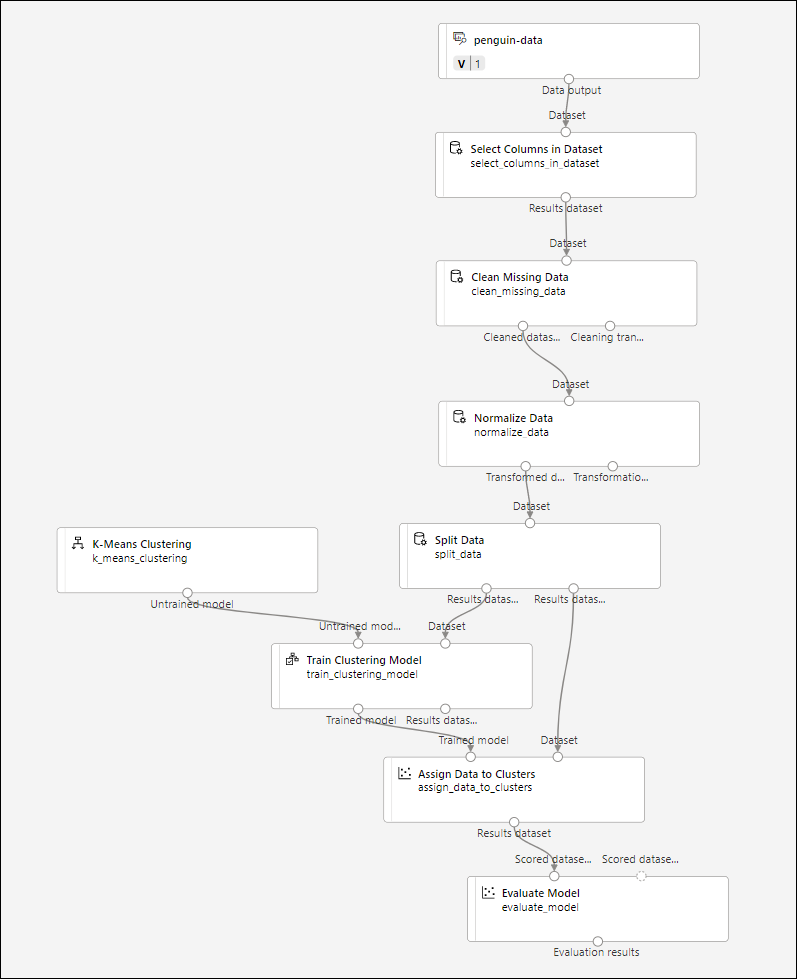

1. Select **Submit**, and run the pipeline using the existing **mslearn-penguin-training** experiment.

1. Wait for the experiment run to finish.

1. When the experiment run has finished, select **Job detail**. Right click on the **Evaluate Model** module and select **Preview data**, then select **Evaluation results**. Review the metrics in each row:
    - **Average Distance to Other Center**
    - **Average Distance to Cluster Center**
    - **Number of Points**
    - **Maximal Distance to Cluster Center**

1. Close the **Evaluate Model result visualization** tab.

Now that you have a working clustering model, you can use it to assign new data to clusters in an *inference pipeline*.

After creating and running a pipeline to train the clustering model, you can create an *inference pipeline*. The inference pipeline uses the model to assign new data observations to clusters. This model will form the basis for a predictive service that you can publish for applications to use.

## Create an inference pipeline

1. In Azure Machine Learning studio, expand the left-hand pane by selecting the menu icon at the top left of the screen. Click on **Jobs** (under **Assets**) to view all of the jobs you have run. Select the experiment **mslearn-penguin-training**, then select the **Train Penguin Clustering** pipeline. 

1. Locate the menu above the canvas and click on **Create inference pipeline**. You may need to expand your screen to full and click on the **...** icon on the top right hand corner of the screen in order to find **Create inference pipeline** in the menu.  

     

1. In the **Create inference pipeline** drop-down list, click **Real-time inference pipeline**. After a few seconds, a new version of your pipeline named **Train Penguin Clustering-real time inference** will be opened.

1. Navigate to **Settings** on the upper right hand menu. Under **Draft details**, rename the new pipeline to **Predict Penguin Clusters**, and then review the new pipeline. The transformations and clustering model in your training pipeline are a part of this pipeline. The trained model will be used to score the new data. The pipeline also contains a web service output to return results. 

    You're going to make the following changes to the inference pipeline:

    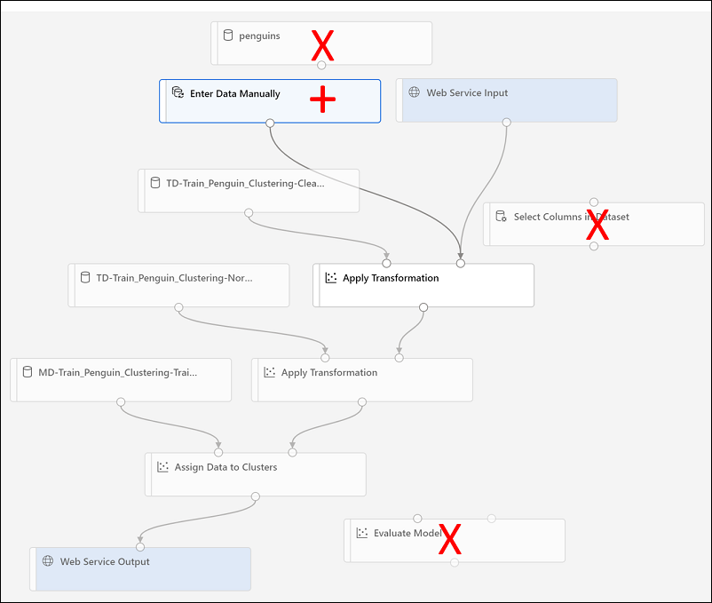

    - Add a **web service input** component for new data to be submitted.
    - Replace the **penguin-data** dataset with an **Enter Data Manually** module that doesn't include the **Species** column.
    - Remove the **Select Columns in Dataset** module, which is now redundant.
    - Connect the **Web Service Input** and **Enter Data Manually** modules (which represent inputs for data to be clustered) to the first **Apply Transformation** module.

    Follow the remaining steps below, using the image and information above for reference as you modify the pipeline.

1. The pipeline does not automatically include a **Web Service Input** component for models created from custom data sets. Search for a **Web Service Input** component from the asset library and place it at the top of the pipeline.  Connect the output of the **Web Service Input** component to input of the **Select Columns in Dataset** component that is already on the canvas.  

1. The inference pipeline assumes that new data will match the schema of the original training data, so the **penguin-data** dataset from the training pipeline is included. However, this input data includes a column for the penguin species, which the model does not use. Delete both the **penguin-data** dataset and the **Select Columns in Dataset** modules, and replace them with an **Enter Data Manually** module from the **Asset library**. Then modify the settings of the **Enter Data Manually** module to use the following CSV input, which contains feature values for three new penguin observations (including headers):

    ```CSV
    CulmenLength,CulmenDepth,FlipperLength,BodyMass
    39.1,18.7,181,3750
    49.1,14.8,220,5150
    46.6,17.8,193,3800
    ```

1. Connect the outputs from both the **Web Service Input** and **Enter Data Manually** modules to the Dataset (right) input of the first **Apply Transformation** module.

1. Delete the **Evaluate Model** module.

1. Verify that your pipeline looks similar to the following image:

    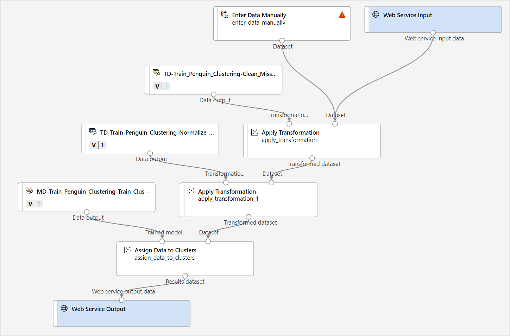

1. Submit the pipeline as a new experiment named **mslearn-penguin-inference** on your compute cluster. The experiment may take a while to run.

1. When the pipeline has finished, select **Job detail**. In the new tab, right click on **Assign Data to Clusters** module, select **Preview data** and select **Results dataset** to see the predicted cluster assignments and metrics for the three penguin observations in the input data.

Your inference pipeline assigns penguin observations to clusters based on their features. Now you're ready to publish the pipeline so that client applications can use it.

>**Note**
>In this exercise, you'll deploy the web service to to an Azure Container Instance (ACI). This type of compute is created dynamically, and is useful for development and testing. For production, you should create an *inference cluster*, which provide an Azure Kubernetes Service (AKS) cluster that provides better scalability and security.

## Deploy a service

1. View the **Predict Penguin Clusters** inference pipeline you created in the previous unit.

1. Select **Job detail** on the left hand pane. This will open up another tab.

   

1. In the new tab, select **Deploy**.

   

1. Deploy a new real-time endpoint, using the following settings:
    -  **Name**: predict-penguin-clusters
    -  **Description**: Cluster penguins.
    - **Compute type**: Azure Container Instance

1. Wait for the web service to be deployed - this can take several minutes. 

1. To view the deployment status, expand the left pane by selecting the menu icon at the top left of the screen. View the **Endpoints** page (under **Assets**) and select **predict-penguin-clusters**. When the deployment has finished, the **Deployment state** will change to **Healthy**.

  >**Note:** 
  >It will take 15-20 mins
 

## Test the service

1. On the **Endpoints** page, open the **predict-penguin-clusters** real-time endpoint, and select the **Test** tab.

    

1. We will use it to test our model with new data. Delete the current data under **Input data to test real-time endpoint**. Copy and paste the below data into the data section: 

    ```JSON
    {
        "Inputs": {
            "input1": [
                {
                    "CulmenLength": 49.1,
                    "CulmenDepth": 4.8,
                    "FlipperLength": 1220,
                    "BodyMass": 5150
                }
            ]
        },
        "GlobalParameters":  {}
    }
    ```

    > **Note**
    > The JSON above defines features for a penguin, and uses the **predict-penguin-clusters** service you created to predict a cluster assignment.

1. Select **Test**. On the right hand of the screen, you should see the output **'Assignments'**. Notice how the assigned cluster is the one with the shortest distance to cluster center.

    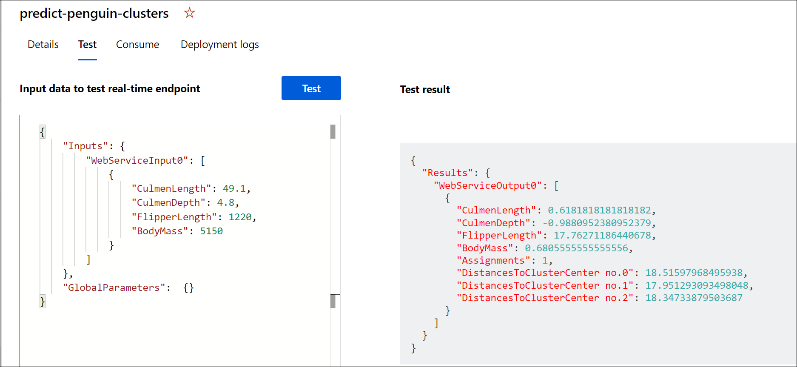

You have just tested a service that is ready to be connected to a client application using the credentials in the **Consume** tab. We will end the lab here. You are welcome to continue to experiment with the service you just deployed.
