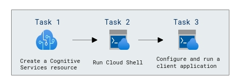
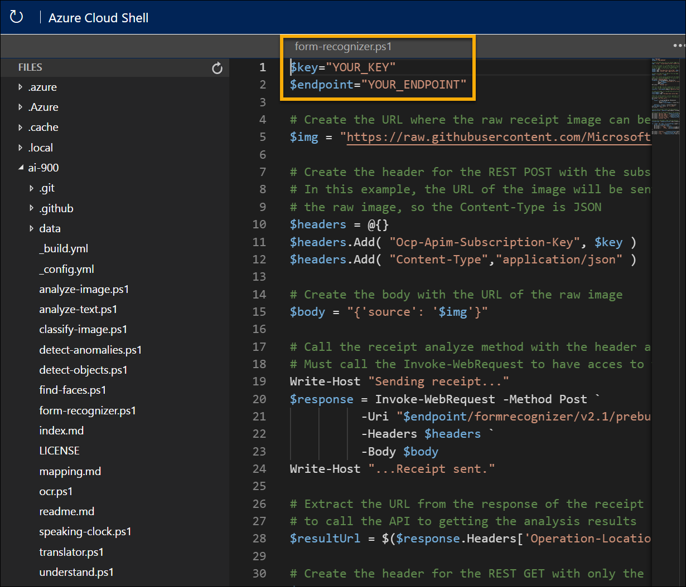
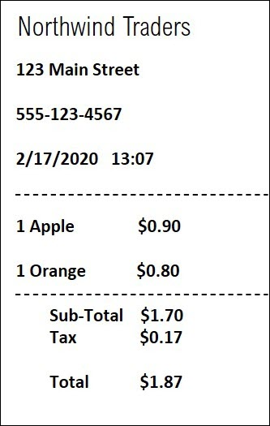

# Module 04: Explore form recognition

## Lab overview

In the artificial intelligence (AI) field of computer vision, optical character recognition (OCR) is commonly used to read printed or handwritten documents. Often, the text is simply extracted from the documents into a format that can be used for further processing or analysis.

A more advanced OCR scenario is the extraction of information from forms, such as purchase orders or invoices, with a semantic understanding of what the fields in the form represent. The **Form Recognizer** service is specifically designed for this kind of AI problem.

Form Recognizer uses machine learning models trained to extract text from images of invoices, receipts, and more. While other computer vision models can capture text, Form Recognizer also captures the structure of the text, such as key/value pairs and information in tables. This way, instead of having to manually type in entries from a form into a database, you can automatically capture the relationships between text from the original file. 

To test the capabilities of the Form Recognizer service, we'll use a simple command-line application that runs in the Cloud Shell. The same principles and functionality apply in real-world solutions, such as web sites or phone apps.

## Lab objective
In this lab, you will perform:
+ Create a *Cognitive Services* resource

## Estimated timing: 60 minutes

## Architecture Diagram


## Exercise 1: Create a *Cognitive Services* resource

### Task 1: Create a Cognitive Services resource

You can use the Form Recognizer service by creating either a **Form Recognizer** resource or a **Cognitive Services** resource.

If you haven't already done so, create a **Cognitive Services** resource in your Azure subscription.

1. Click the **&#65291;Create a resource** button, search for *Cognitive Services*, and create a **Cognitive Services** resource with the following settings:
    - **Subscription**: *Use existing Azure subscription*.
    - **Resource group**: **AI-900-Module-03e-<inject key="DeploymentID" enableCopy="false"/>**
    - **Region**: Select **<inject key="location" enableCopy="false"/>**
    - **Name**: *enter **ai900cognitive-<inject key="DeploymentID" enableCopy="false"/>***
    - **Pricing tier**: Standard S0
    - **By checking this box I acknowledge that I have read and understood all the terms below**: Selected.

1. Click on **Review and create**.
   
1. After successfully completing the validation process, click on the **Create** button located in the lower left corner of the page.
   
1. Wait for deployment to complete(it can take a few minutes), and then click on the **Go to resource** button, this will take you to your Cognitive Service.

1. View the **Keys and Endpoint** page for your Cognitive Services resource. Copy and save the **KEY 1** and **Endpoint** value to NotePad for future reference to connect from client applications. 

### Task 2: Run Cloud Shell

To test the capabilities of the Form Recognizer service, we'll use a simple command-line application that runs in the Cloud Shell on Azure. 

1. In the Azure portal, select the **[>_]** (*Cloud Shell*) button at the top of the page to the right of the search box. This opens a Cloud Shell pane at the bottom of the portal. 

    

1. The first time you open the Cloud Shell, you may be prompted to choose the type of shell you want to use (*Bash* or *PowerShell*). Select **PowerShell**. If you do not see this option, skip the step.  

1. If you are prompted to create storage for your Cloud Shell, ensure your subscription is selected and click on **Show advanced settings**. Please make sure you have selected your resource group AI-900-Module-03e-<inject key="DeploymentID" enableCopy="false"/> and enter **blob<inject key="DeploymentID" enableCopy="false"/>** for the **Storage account** and enter **blobfileshare<inject key="DeploymentID" enableCopy="false"/>** for the  **File share** , then click on **Create Storage**.
    
    

1. Make sure the type of shell indicated on the top left of the Cloud Shell pane is switched to *PowerShell*. If it is *Bash*, switch to *PowerShell* by using the drop-down menu.

     

1. Wait for PowerShell to start. You should see the following screen in the Azure portal:  

     

### Task 3: Configure and run a client application

Now that you have a custom model, you can run a simple client application that uses the Form Recognizer service.

1. In the command shell, enter the following command to download the sample application and save it to a folder called ai-900.

    ```PowerShell
    git clone https://github.com/MicrosoftLearning/AI-900-AIFundamentals ai-900
    ```

1. The files are downloaded to a folder named **ai-900**. Now we want to see all of the files in your Cloud Shell storage and work with them. Type the following command into the shell:

    ```PowerShell
    code .
    ```

    Notice how this opens up an editor like the one in the image below: 

    

1. In the **Files** pane on the left, expand **ai-900** and select **form-recognizer.ps1**. This file contains some code that uses the Form Recognizer service to analyze the fields in a receipt, as shown here:

    

1. Don't worry too much about the details of the code, the important thing is that it needs the endpoint URL and either of the keys for your Cognitive Services resource.  Copy these from the **Keys and Endpoints** page for your resource (Task 1, Step 5) and paste them into the code editor, replacing the **YOUR_KEY** with *KEY 1* and **YOUR_ENDPOINT** with *Endpoint* placeholder values, respectively.

    > **Tip**: You may need to use the separator bar to adjust the screen area as you work with the **Keys and Endpoint** and **Editor** panes.

    After pasting the key and endpoint values, the first two lines of code should look similar to this:

    
     > $key="1a2b3c4d5e6f7g8h9i0j...."    
     > $endpoint="https..."
    

1.  After making the changes to the variables in the code, press **CTRL+S** to save the file. Then press **CTRL+Q** to close the code editor. Now that you've set up the key and endpoint, you can use your resource to analyze fields from a receipt. In this case, you'll use the Form Recognizer's built-in model to analyze a receipt for the fictional Northwind Traders retail company.

    The sample client application will analyze the following image:

    

    In the PowerShell pane, enter the following commands to run the code to read the text:

    ```PowerShell
    cd ai-900
    ```
    
    ```PowerShell
    ./form-recognizer.ps1
    ```

1. Review the returned results. See that Form Recognizer is able to interpret the data in the form, correctly identifying the merchant address and phone number, and the transaction date and time, as well as the line items, subtotal, tax, and total amounts.

   > **Congratulations** on completing the task! Now, it's time to validate it. Here are the steps:
   > - Click Lab Validation tab located at the upper right corner of the lab guide section and navigate to the Lab Validation tab.
   > - Hit the Validate button for the corresponding task.
   > - If you receive a success message, you can proceed to the next task. If not, carefully read the error message and retry the step, following the instructions in the lab guide.
   > - If you need any assistance, please contact us at labs-support@spektrasystems.com. We are available 24/7 to help you out.

### Learn more

This simple app shows only some of the Form Recognizer capabilities of the Computer Vision service. To learn more about what you can do with this service, see the [Form Recognizer page](https://docs.microsoft.com/azure/applied-ai-services/form-recognizer/overview).

### Review
In this lab, you have completed:
- Create a *Cognitive Services* resource
  
### You have successfully completed this lab.
