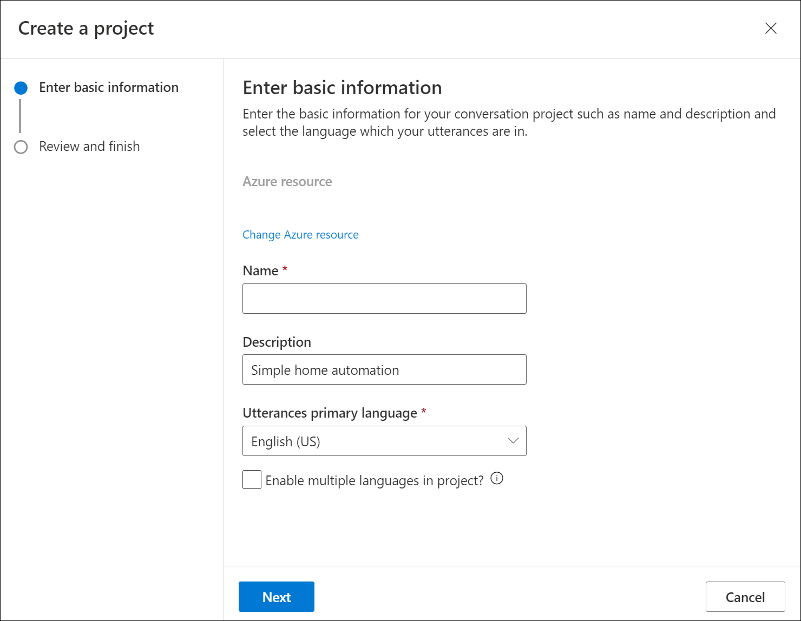
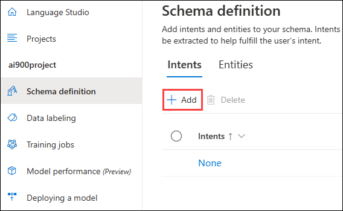
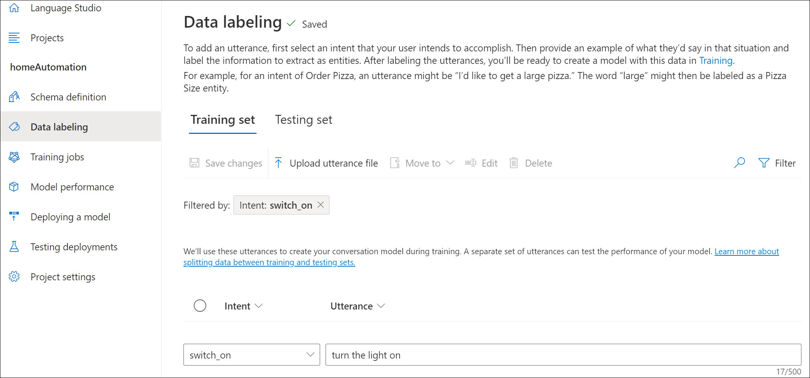
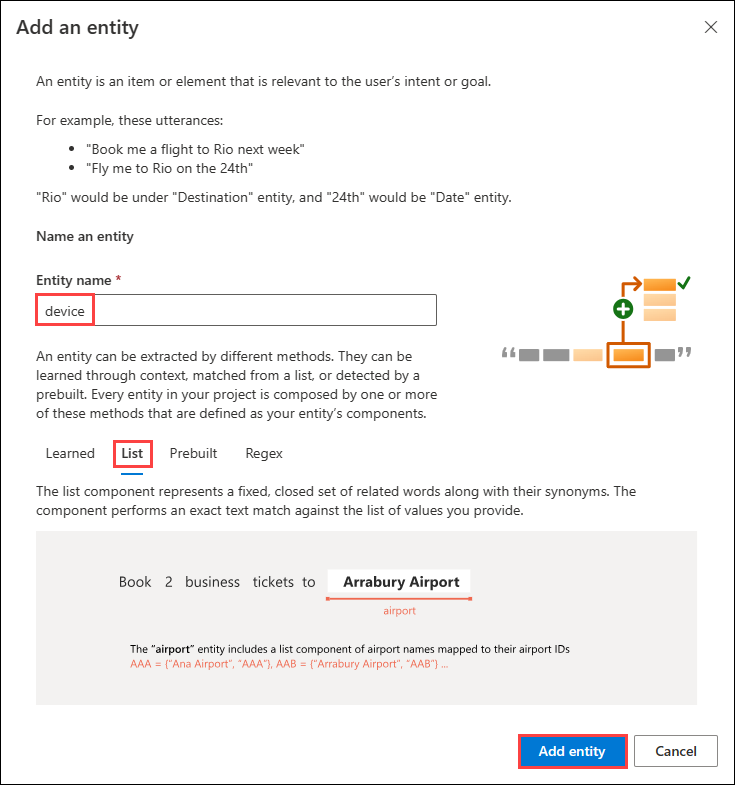
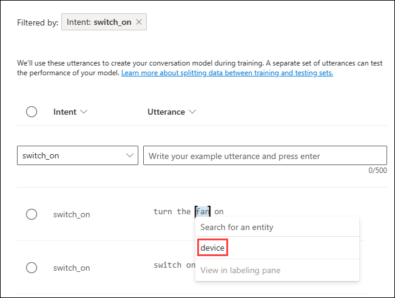
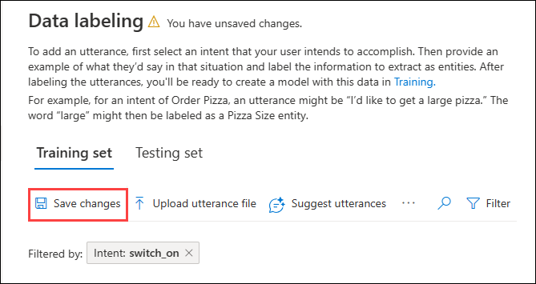
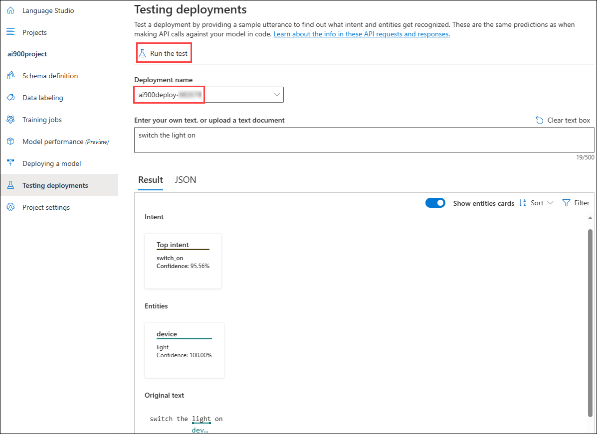
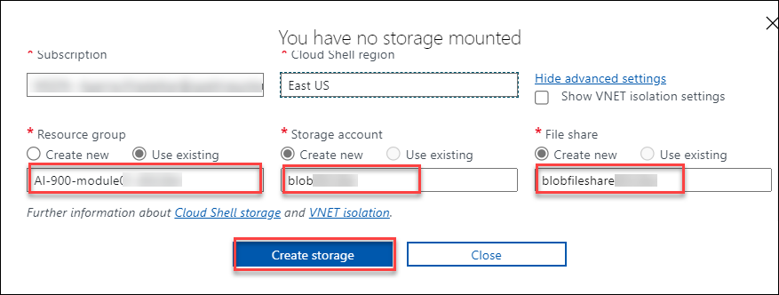
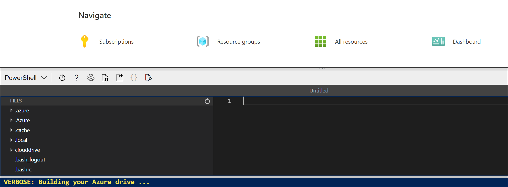

# Module 04c: Explore language understanding

Increasingly, we expect computers to be able to use AI in order to understand spoken or typed commands in natural language. For example, you might want to implement a home automation system that enables you to control devices in your home by using voice commands such as "switch on the light" or "put the fan on", and have an AI-powered device understand the command and take appropriate action.

To test the capabilities of the Conversational Language Understanding service, we'll use a command-line application that runs in the Cloud Shell. The same principles and functionality apply in real-world solutions, such as web sites or phone apps.

In this lab, you will: 
- Create and use a Language Service resource.
- Configure and run a client application.

## Exercise 1: Create a *Language service* resource

You can use the Conversational Language Understanding service by creating a **Language service** resource.

1. Click the **&#65291;Create a resource** button, search for *Language service*, and create a **Language service** resource with the following settings:
    - **Select additional features**: *Keep the default features and click Continue to create your resource*  
    - **Subscription**: Use exsiting subscription.
    - **Resource group**: Select **AI-900-Module-04c-<inject key="DeploymentID" enableCopy="false"/>**
    - **Region**: **<inject key="location" enableCopy="false"/>**
    - **Name**: enter **learnlanguage-<inject key="DeploymentID" enableCopy="false"/>**
    - **Pricing tier**: S (1K Calls per minute)
    - **By checking this box I certify that I have reviewed and acknowledge the terms in the Responsible AI Notice**: Selected.

1. Click on **Review and create**.
   
1. After successfully completing the validation process, click on the **Create** button located in the lower left corner of the page.
   
1. Wait for deployment to complete(it can take a few minutes), and then click on the **Go to resource** button, this will take you to your Cognitive Service.

### Task 1: Create a Conversational Language Understanding App

To implement natural language understanding with Conversational Language Understanding, you create an app; and then add entities, intents, and utterances to define the commands you want the app to execute.

1. In a new browser tab, open the Language Studio portal at [https://language.azure.com](https://language.azure.com?azure-portal=true) and sign in using the Microsoft account associated with your Azure subscription.

1. If prompted to choose a Language resource, select the following settings and then click on **Done**: 
    - **Azure directory**: The Azure directory containing your subscription.
    - **Azure subscription**: Select exsiting subscription.
    - **Resource type**: Language.
    - **Resource name**: **learnlanguage-<inject key="DeploymentID" enableCopy="false"/>**
    
    >**Tip :**
    >If you are ***not*** prompted to choose a language resource, it may be because you have multiple Language resources in your subscription; in which case:
    >1. On the bar at the top if the page, click the **Settings (&#9881;)** button.
    >1. On the **Settings** page, view the **Resources** tab.
    >1. Select your language resource, and click **Switch resource**.
    >1. At the top of the page, click **Language Studio** to return to the Language Studio home page.

1. At the top of the portal, in the **Create new** menu, select **Conversational language understanding**.

1. In the **Create a project** dialog box, on the **Enter basic information** page, enter the following details and click **Next**:
    - **Name**: enter **ai900project**
    - **Description**: Simple home automation
    - **Utterances primary language**: English
    - **Enable multiple languages in project**: Do not select
    

    
   

    >**Tip :**  Write down your *project name*, you will use it later.

1. On the *Review and finish* page, click **Create**.

### Task 2: Create intents, utterances, and entities

An **intent** is an action you want to perform - for example, you might want to switch on a light, or turn off a fan. In this case, you'll define two intents: one to switch on a device, and another to switch off a device. For each intent, you'll specify sample *utterances* that indicate the kind of language used to indicate the intent.

1. In the **Schema definition** pane, ensure that **Intents** is selected Then click **Add**, and add an intent with the name **switch_on** (in lower-case) and click **Add intent**.

    
    
    

1. Select the **switch_on** intent. It will take you to the **Data labeling** page. In the **Intent** drop down, select **switch_on**. Next to the **switch_on** intent, type the utterance **turn the light on** and press **Enter** to submit this utterance to the list.

    

1. The language service needs at least five different utterance examples for each intent to sufficiently train the language model. Add five more utterance examples for the **switch_on** intent:  
    - **switch on the fan**
    - **put the fan on**
    - **put the light on**
    - **switch on the light**
    - **turn the fan on**

1. On the **Labeling entities for training** pane on the right-hand side of the screen, select **Labels**, then select **Add entity**. Type **device** (in lower-case), select **List** and select **Add entity**.

     
    
    

1. In the **turn the fan on** utterance, highlight the word "fan". Then in the list that appears, in the *Search for an entity* box select **device**.

    

1. Do the same for all the utterances. Label the rest of the *fan* or *light* utterances with the **device** entity. When you're finished, verify that you have the following utterances and make sure to select **Save changes**:

    | **intent** | **utterance** | **entity** |
    | --------------- | ------------------ | ------------------ |
    | switch_on   | turn the fan on     | Device - *select fan* |
    | switch_on   | switch on the light | Device - *select light* |
    | switch_on   | put the light on    | Device - *select light* |
    | switch_on   | put the fan on      | Device - *select fan* |
    | switch_on   | switch on the fan   | Device - *select fan* |
    | switch_on   | turn the light on   | Device - *select light* |

     

1. In the pane on the left, click **Schema definition** and verify that your **switch_on** intent is listed. Then click **Add** and add a new intent with the name **switch_off** (in lower-case).

    

1. Click on the **switch_off** intent. It will take you to the **Data labeling** page. In the **Intent** drop down, select **switch_off**. Next to the **switch_off** intent, add the utterance ***turn the light off***.

1. Add five more utterance examples to the **switch_off** intent.
    - **switch off the fan**
    - **put the fan off**
    - **put the light off**
    - **turn off the light**
    - **switch the fan off**

1. Label the words *light* or *fan* with the **device** entity. When you're finished, verify that you have the following utterances and make sure to select **Save changes**:  

    | **intent** | **utterance** | **entity** | 
    | --------------- | ------------------ | ------------------ |
    | switch_off   | Put the fan off    | Device - *select fan* | 
    | switch_off   | Put the light off  | Device - *select light* |
    | switch_off   | Turn off the light | Device - *select light* |
    | switch_off   | Switch the fan off | Device - *select fan* |
    | switch_off   | Switch off the fan | Device - *select fan* |
    | switch_off   | Turn the light off | Device - *select light* |

### Task 3: Train the model

Now you're ready to use the intents and entities you have defined to train the conversational language model for your app.

1. On the left hand side of Language Studio, select **Training jobs**, then select **Start a training job**. Use the following settings: 
    - **Train a new model**: **ai900train-<inject key="DeploymentID" enableCopy="false" />**
    - **Training mode**: Standard training (free)
    - **Data Splitting**: Select **Automatically split the testing set from the training data** and keep default percentages.
    - Click **Train** at the bottom of the page.

1. Wait for training to complete. 

### Task 4: Deploy and test the model

To use your trained model in a client application, you must deploy it as an endpoint to which the client applications can send new utterances; from which intents and entities will be predicted.

1. On the left-hand side of Language Studio, click **Deploying a model**.

1. Click **Add deployment** and use the following settings:
    - **Create a new deployment name**: **ai900deploy-<inject key="DeploymentID" enableCopy="false" />**
    - **Assign trained model to your deployment name**: Select the name of the trained model.
    - Click **Deploy**

    
    >**Tip :**
    > Write down your *deployment name*, you will use it later. 

1. When the model is deployed, click **Testing deployments** on the left-hand side of the page, and then select your deployed model under **Deployment name**.

1. Enter the following text, and then select **Run the test**:

    *switch the light on*

     

    Review the result that is returned, noting that it includes the predicted intent (which should be **switch_on**) and the predicted entity (**device**) with confidence scores that indicates the probability the model calculated for the predicted intent and entity. The JSON tab shows the comparative confidence for each potential intent (the one with the highest confidence score is the predicted intent)

1. Clear the text box and test the model with the following utterances under *Enter your own text, or upload a text document*:
    - *turn off the fan*
    - *put the light on*
    - *put the fan off*

## Exercise 2: Run Cloud Shell

Now let's try out your deployed model. To do so, we'll use a command-line application that runs in the Cloud Shell on Azure. 

1. Leaving the browser tab with Language Studio open, switch back to browser tab containing the Azure portal.

1. In the Azure portal, select the **[>_]** (*Cloud Shell*) button at the top of the page to the right of the search box. Clicking the button opens a Cloud Shell pane at the bottom of the portal.

    .png)

1. The first time you open the Cloud Shell, you may be prompted to choose the type of shell you want to use (*Bash* or *PowerShell*). Select **PowerShell**. If you do not see this option, skip the step.  

1. If you are prompted to create storage for your Cloud Shell, ensure your subscription is selected and click on **Show advanced settings**. Please make sure you have selected your resource group **AI-900-Module-04c-<inject key="DeploymentID" enableCopy="false"/>** and enter **blob<inject key="DeploymentID" enableCopy="false"/>** for the **Storage account Name** and enter **blobfileshare<inject key="DeploymentID" enableCopy="false"/>** for the **File share Name** , then click on **Create Storage**.

    
    
1. Make sure the type of shell indicated on the top left of the Cloud Shell pane is switched to **PowerShell**. If it is **Bash**, switch to *PowerShell* by using the drop-down menu.

     

1. Wait for PowerShell to start. You should see the following screen in the Azure portal:  

     

## Exercise 3: Configure and run a client application

Now let's open and edit a pre-written script, which will run the client application.

1. In the command shell, enter the following command to download the sample application and save it to a folder called ai-900.

    ```PowerShell
    git clone https://github.com/MicrosoftLearning/AI-900-AIFundamentals ai-900
    ```

1. The files are downloaded to a folder named **ai-900**. Now we want to see all of the files in this folder and work with them. Type the following commands into the shell:

     ```PowerShell
    cd ai-900
    code .
    ```

    Notice how the script opens up an editor like the one in the image below: 

    

1. In the **Files** pane on the left, select the **understand.ps1** file. This file contains some code that uses your Conversational Language Understanding model. 

    

    Don't worry too much about the details of the code. The important thing is that you'll use the instructions below to modify the file to specify the language model you trained. 

1. Switch back to the browser tab containing **Language Studio**. Then in Language Studio, open the **Deploying a model** page and select your model. Then click the **Get prediction URL** button. The two pieces of information you need are in this dialog box:
    - The endpoint for your model - you can copy the endpoint from the **Prediction URL** box.
    - The key for your model - the key is in the **Sample request** as the value for the **Ocp-Apim-Subscription-Key** parameter, and looks similar to **0ab1c23de4f56gh7i8901234jkl567m8**.

1. Copy the endpoint value, then switch back to the browser tab containing the Cloud Shell and paste it into the code editor, replacing **YOUR_ENDPOINT** (within the quotation marks). The repeat that process for the key, replacing **YOUR_KEY**.

1. Next, replace **YOUR_PROJECT_NAME** with the name of your project, and replace **YOUR_DEPLOYMENT_NAME** with the name of your deployed model. The first lines of code should look similar to what you see below:
   
   > $endpointUrl="https://some-name.cognitiveservices.azure.com/language/..."
     $key = "0ab1c23de4f56gh7i8901234jkl567m8"
     $projectName = "name"
     $deploymentName = "name"
   
    
1. After making the changes to the variables in the code, press **CTRL+S** to save the file. Then press **CTRL+Q** to close the code editor.

1. In the PowerShell pane, enter the following command to run the code:

    ```PowerShell
    ./understand.ps1 "Turn on the light"
    ```

1. Review the results. The app should have predicted that the intended action is to switch on the light.

1. Now try another command:

    ```PowerShell
    ./understand.ps1 "Switch the fan off"
    ```

1. Review the results from this command. The app should have predicted that the intended action is to switch off the fan.

1. Experiment with a few more commands; including commands that the model was not trained to support, such as "Hello" or "switch on the oven". The app should generally understand commands for which its language model is defined, and fail gracefully for other input.

>**Note :**
> Each time you will need to start with **./understand.ps1** followed by the phrase. Include quotation marks around your phrase.

**Congratulations** on completing the task! Now, it's time to validate it. Here are the steps:

  > - Navigate to the Lab Validation tab, from the upper right corner in the lab guide section.
  > - Hit the Validate button for the corresponding task. If you receive a success message, you can proceed to the next task. 
  > - If not, carefully read the error message and retry the step, following the instructions in the lab guide.
  > - If you need any assistance, please contact us at [labs-support@spektrasystems.com](labs-support@spektrasystems.com).We are available 24/7 to help you out.

## Learn more

This app shows only some of the capabilities of the Conversational Language Understanding feature of the Language service. To learn more about what you can do with this service, see the [Conversational Language Understanding page](https://docs.microsoft.com/azure/cognitive-services/language-service/conversational-language-understanding/overview). 
